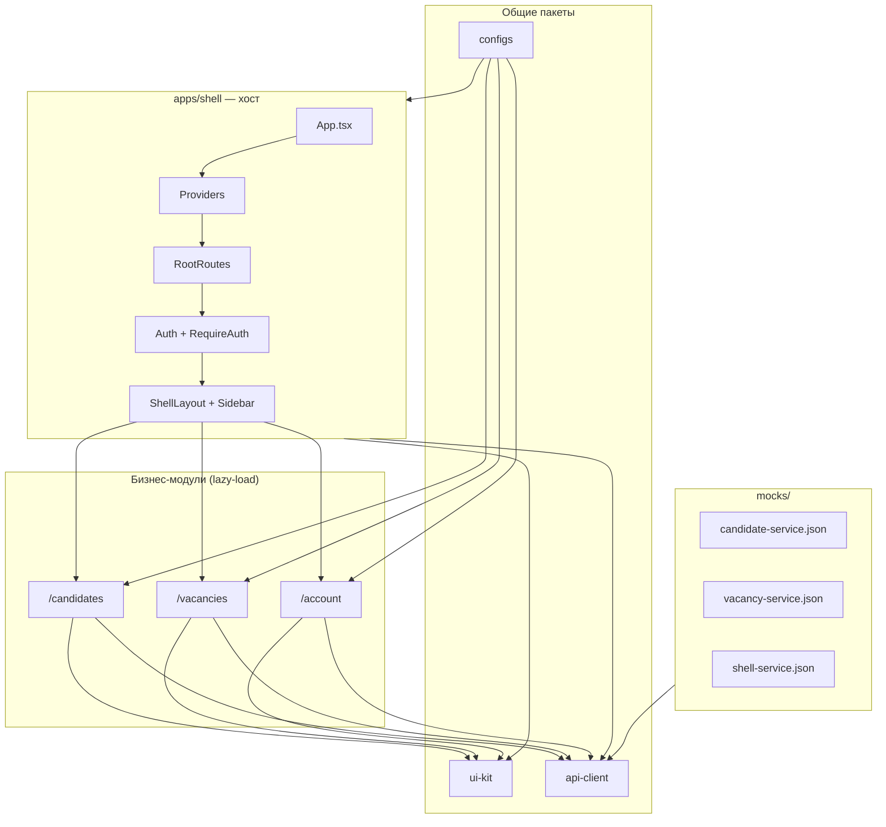
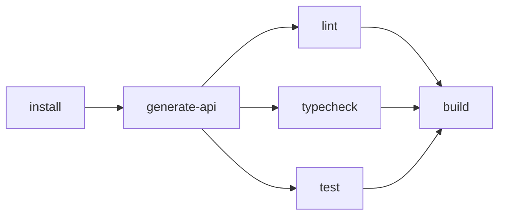
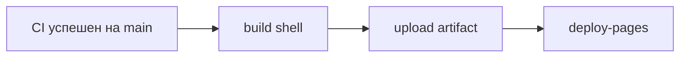

# IQHR

Модульный монолит HR-платформы: один фронтенд, несколько бизнес-модулей, общий UI Kit и API-клиент. Модули подключаются в `shell` через Vite-алиасы и lazy-load — без Module Federation и без отдельных деплоев на этапе разработки.

---

## Содержание

- [Быстрый старт](#быстрый-старт)
- [Стек](#стек)
- [Архитектура](#архитектура)
- [Структура репозитория](#структура-репозитория)
- [Разработка](#разработка)
- [Модули и маршруты](#модули-и-маршруты)
- [API-клиент](#api-клиент)
- [UI Kit](#ui-kit)
- [Алиасы импортов](#алиасы-импортов)
- [Окружения](#окружения)
- [Скрипты](#скрипты)
- [Тесты](#тесты)
- [CI](#ci)
- [GitHub Pages](#github-pages)
- [Качество кода](#качество-кода)

---

## Быстрый старт

**Требования:** Node.js **22+** (см. `.nvmrc`), [pnpm](https://pnpm.io/) **10+**.

```bash
# 1. Установка зависимостей
pnpm install

# 2. Генерация API-клиента из OpenAPI-моков
pnpm generate:api:dev

# 3. Запуск приложения
pnpm dev
```

Откройте [http://localhost:5173](http://localhost:5173).

**Демо-вход** на `/login`: кнопка подставляет `admin` / `iqhr-demo-local`. В режиме моков принимается любой пароль от 4 символов.

> **pnpm 10:** postinstall сторонних пакетов по умолчанию не запускается. Если Vite ругается на `esbuild`, выполните один раз:
>
> ```bash
> node node_modules/esbuild/install.js
> ```

---

## Стек

| Категория | Технологии |
| --- | --- |
| Монорепо | Turborepo, pnpm workspaces |
| UI | React 19, React Router v6, Ant Design 6, SCSS Modules |
| Сборка | Vite 7 |
| Данные | TanStack Query, Axios |
| API | OpenAPI → TypeScript-клиент (`api-client`) |
| Качество | Biome, TypeScript 5.9, Vitest, Testing Library |
| Git hooks | Husky, lint-staged |

---

## Архитектура



**Как это работает**

1. `shell` — единая точка входа: авторизация, layout, навигация, роутинг.
2. Модули (`candidates`, `vacancies`, `personal-account`) — отдельные пакеты workspace, но в dev и prod подключаются через Vite-алиасы (`candidates/App`, `vacancies/App` и т.д.).
3. `ui-kit` и `api-client` — shared-пакеты; Turborepo пересобирает зависимые приложения при их изменении (`dependsOn: ["^build"]`).
4. OpenAPI-спеки лежат в `mocks/`; из них генерируется типизированный Axios-клиент.

---

## Структура репозитория

```
monorepa/
├── apps/
│   ├── shell/                  # Хост: роутинг, auth, layout, login
│   │   ├── public/             # favicon, статика
│   │   └── src/
│   │       ├── routes/         # RootRoutes, AuthRoutes, CabinetRoutes
│   │       ├── services/       # Providers, auth, queryClient
│   │       ├── layouts/        # ShellLayout
│   │       ├── navigation/     # меню, lazy-import модулей
│   │       └── constants/      # пути, привилегии, storage
│   ├── candidates/             # Модуль «Кандидаты»
│   ├── vacancies/              # Модуль «Вакансии»
│   └── personal-account/       # Личный кабинет
├── packages/
│   ├── ui-kit/                 # Компоненты, тема, дизайн-токены
│   ├── api-client/             # HTTP-клиент + generated API
│   └── configs/                # biome, tsconfig, vite, vitest, openapi
├── mocks/                      # OpenAPI-спеки (dev / моки)
├── scripts/                    # generate-api, update-ui-kit, stop-dev
└── .github/workflows/ci.yml
```

---

## Разработка

### Основной сценарий — один dev-сервер

Достаточно запустить `shell`. Код всех модулей и пакетов подтягивается через алиасы — HMR работает по всему монолиту.

```bash
pnpm dev          # shell на :5173
```

### Изолированная разработка модуля

Каждый модуль можно запустить отдельно (удобно для фокусной работы без shell):

| Команда | Порт | URL |
| --- | --- | --- |
| `pnpm dev` | 5173 | [localhost:5173](http://localhost:5173) |
| `pnpm dev:candidates` | 5174 | [localhost:5174](http://localhost:5174) |
| `pnpm dev:vacancies` | 5175 | [localhost:5175](http://localhost:5175) |
| `pnpm dev:account` | 5176 | [localhost:5176](http://localhost:5176) |
| `pnpm dev:ui-kit` | — | watch-сборка пакета |

```bash
pnpm dev:all      # все dev-серверы параллельно
pnpm dev:stop     # остановить зависшие процессы Vite
```

### Сборка

```bash
pnpm build              # все пакеты
pnpm build:affected     # только затронутые изменениями
```

Прод-артефакт хоста: `apps/shell/dist`.

---

## Модули и маршруты

| Маршрут | Модуль | Описание |
| --- | --- | --- |
| `/login` | shell | Страница входа |
| `/candidates/*` | candidates | Список и карточка кандидата |
| `/vacancies/*` | vacancies | Список и карточка вакансии |
| `/account/*` | personal-account | Профиль и настройки |
| `/` | — | Редирект на `/candidates` |

Доступ к разделам контролируется привилегиями (`candidates:read`, `vacancies:read`, `account:read`) через `PrivilegeGuard` в UI Kit.

**Структура shell-приложения:**

```
App.tsx
├── Providers          # Theme, Query, Auth, Ant Design
├── ReactEffects       # побочные эффекты (тема, токен и т.д.)
└── RootRoutes
    ├── AuthRoutes     # /login
    └── CabinetRoutes  # защищённые маршруты + ShellLayout
```

---

## API-клиент

Спецификации OpenAPI — в `mocks/`. Конфиг генераторов — `packages/configs/openapitools-axios.json`.

```bash
# Все сервисы
pnpm generate:api:dev

# Только для конкретного приложения
pnpm generate:api:dev --app=candidates
pnpm generate:api:dev --app=vacancies
pnpm generate:api:dev --app=shell
pnpm generate:api:dev --app=personal-account
```

| Mock-файл | Сервис |
| --- | --- |
| `candidate-service.json` | Кандидаты |
| `vacancy-service.json` | Вакансии |
| `shell-service.json` | Auth, пользователи, shell API |

Генерация кешируется Turborepo: перезапускается только при изменении спеков или скрипта.

**Два генератора:**

- **Node-генератор** (по умолчанию в CI: `FORCE_NODE_GENERATOR=1`) — не требует Java.
- **openapi-generator-cli** — используется локально, если установлена Java; при ошибке скрипт автоматически откатывается на Node-генератор.

**Использование в коде:**

```ts
import { CandidatesApi } from 'api-client';
import type { Candidate, CandidateStatus } from 'api-client/types';
```

Сгенерированные файлы: `packages/api-client/src/generated/`.

---

## UI Kit

Общая библиотека компонентов на базе Ant Design.

**Компоненты:** `Button`, `Card`, `Input`, `Select`, `Sidebar`, `Layout`, `PageHeader`, `StatCard`, `StatusTag`, `EntityAvatar`, `PrivilegeGuard`, `ErrorBoundary`, `Spinner`.

**Тема:** светлая / тёмная через `ThemeProvider`. Дизайн-токены — `packages/ui-kit/src/styles/tokens.css`:

| Токен | Значение |
| --- | --- |
| `--color-primary` | `#41c597` |
| `--color-primary-hover` | `#33b789` |
| `--color-secondary` | `#fda610` |
| `--color-text` | `#434a50` |

SCSS-миксины (`packages/ui-kit/src/styles/_mixins.scss`) автоматически подключаются во все `.module.scss` через Vite `additionalData`.

**Обновление версии ui-kit** (bump + build + пересборка потребителей):

```bash
pnpm update-ui-kit --version=1.0.1
```

---

## Алиасы импортов

Настроены в `packages/configs/vite.config.base.ts` и `packages/configs/tsconfig.react.json`.

| Алиас | Назначение |
| --- | --- |
| `ui-kit` | Компоненты и тема |
| `ui-kit/dev` | Утилиты для standalone-запуска модулей |
| `api-client` | HTTP-клиент и API-классы |
| `api-client/types` | Типы и модели из Swagger |
| `candidates/*` | Исходники модуля кандидатов |
| `vacancies/*` | Исходники модуля вакансий |
| `personal-account/*` | Исходники личного кабинета |
| `@configs/*` | Файлы конфигурации (TypeScript paths) |

```ts
import { PageHeader, StatusTag } from 'ui-kit';
import { VacanciesApi } from 'api-client';
import type { Vacancy } from 'api-client/types';
```

> **Порядок алиасов важен:** `ui-kit/dev` должен быть объявлен **до** `ui-kit`.

---

## Окружения

Переменные Vite — в `apps/shell/`:

| Файл | Назначение |
| --- | --- |
| `.env.development` | Локальная разработка (моки включены) |
| `.env.staging` | Staging-сборка |
| `.env.production` | Production-сборка |

| Переменная | Описание | Dev |
| --- | --- | --- |
| `VITE_APP_TITLE` | Заголовок приложения | `IQHR` |
| `VITE_API_BASE_URL` | Базовый URL бэкенда | пусто (моки) |
| `VITE_USE_MOCKS` | In-memory моки вместо HTTP | `true` |

---

## Скрипты

### Разработка

| Скрипт | Описание |
| --- | --- |
| `pnpm dev` | Shell (:5173) |
| `pnpm dev:candidates` | Модуль кандидатов (:5174) |
| `pnpm dev:vacancies` | Модуль вакансий (:5175) |
| `pnpm dev:account` | Личный кабинет (:5176) |
| `pnpm dev:ui-kit` | Watch-сборка ui-kit |
| `pnpm dev:all` | Все dev-серверы |
| `pnpm dev:stop` | Остановить Vite-процессы |

### Проверки и сборка

| Скрипт | Описание |
| --- | --- |
| `pnpm build` | Сборка всех пакетов |
| `pnpm build:affected` | Сборка затронутых пакетов |
| `pnpm build:pages` | Сборка shell для GitHub Pages (локальная проверка) |
| `pnpm typecheck` | Проверка типов |
| `pnpm typecheck:affected` | Typecheck затронутых |
| `pnpm test` | Все тесты |
| `pnpm test:affected` | Тесты затронутых пакетов |
| `pnpm lint` | Biome с авто-исправлениями |
| `pnpm lint:ci` | Biome без правок (как в CI) |
| `pnpm format` | Форматирование Biome |
| `pnpm generate:api:dev` | Генерация API-клиента |

### Локальный CI-прогон

```bash
pnpm ci              # generate → typecheck → lint → build
pnpm ci:affected     # то же, но --affected для typecheck и build
```

Перед PR рекомендуется также:

```bash
pnpm test:affected
```

---

## Тесты

Vitest + React Testing Library. Тесты лежат рядом с компонентами (`*.test.tsx`).

```bash
pnpm test              # все пакеты
pnpm test:affected     # только затронутые
```

Запуск в конкретном пакете:

```bash
pnpm --filter shell test
pnpm --filter candidates test
```

---

## CI

Пайплайн [`.github/workflows/ci.yml`](.github/workflows/ci.yml) — Node **22**, pnpm **10.10**:



| Job | Команда |
| --- | --- |
| Install | `pnpm install --frozen-lockfile` |
| Generate API | `pnpm generate:api:dev` |
| Lint | `pnpm lint:ci` |
| Typecheck | `pnpm typecheck:affected` |
| Test | `pnpm test:affected` |
| Build | `pnpm build:affected` |

Lint, typecheck и test выполняются **параллельно** после генерации API. Build ждёт успешного завершения всех трёх.

### Как работает `--affected`

Turborepo сравнивает текущую ветку с базой (`main` в PR) и запускает задачи только в изменённых пакетах и их зависимых.

| Что изменили | Что пересоберётся |
| --- | --- |
| `apps/vacancies` | `vacancies` (+ `api-client` / `ui-kit`, если в графе) |
| `packages/ui-kit` | `ui-kit` → все приложения-потребители |
| `mocks/*.json` | `api-client` (generate) → потребители |
| `packages/configs` | пакеты, которые от него зависят |

> **Важно:** `shell` не объявляет workspace-зависимость на модули (`candidates`, `vacancies` и т.д.) — они подключаются через Vite-алиасы. Поэтому изменения **только** в модуле могут не попасть в `build:affected` для `shell`. Для полной прод-сборки используйте `pnpm --filter shell build` или `pnpm build`.

---

## GitHub Pages

Демо-сборка публикуется автоматически после успешного CI при пуше в `main`.

**URL:** [https://laksan1.github.io/iqhr-monorepo/](https://laksan1.github.io/iqhr-monorepo/)

Workflow: [`.github/workflows/deploy-pages.yml`](.github/workflows/deploy-pages.yml)



На GitHub Pages включены **моки** (`VITE_USE_MOCKS=true`) — бэкенд не нужен. Демо-вход: `admin` / `iqhr-demo-local`.

### Что включить в GitHub

Репозиторий: [laksan1/iqhr-monorepo](https://github.com/laksan1/iqhr-monorepo)

1. Откройте **Settings → Pages**.
2. В блоке **Build and deployment → Source** выберите **GitHub Actions** (не «Deploy from a branch»).
3. Убедитесь, что репозиторий **публичный** (для бесплатного GitHub Pages на личном аккаунте) **или** у вас есть GitHub Pro/Team для Pages на приватном репо.
4. Запушьте изменения в ветку `main` — сначала отработает **CI**, затем **Deploy GitHub Pages**.
5. Первый деплой может попросить подтвердить environment **github-pages** — нажмите **Approve**, если появится запрос.

Ручной перезапуск деплоя: **Actions → Deploy GitHub Pages → Run workflow**.

### Локальная проверка сборки для Pages

```bash
pnpm build:pages
pnpm --filter shell preview -- --base /iqhr-monorepo/
```

Откройте [http://localhost:4173/iqhr-monorepo/](http://localhost:4173/iqhr-monorepo/).

---

## Качество кода

- **Biome** — единый линтер, форматтер и сортировка импортов (`packages/configs/biome.json`).
- **Husky + lint-staged** — Biome на staged-файлах перед каждым коммитом.
- **TypeScript** — `strict: true`, `noUncheckedIndexedAccess: true`.

```bash
pnpm lint      # проверить и исправить
pnpm format    # отформатировать
```

---

## Лицензия

Private — внутренний проект IQHR.
